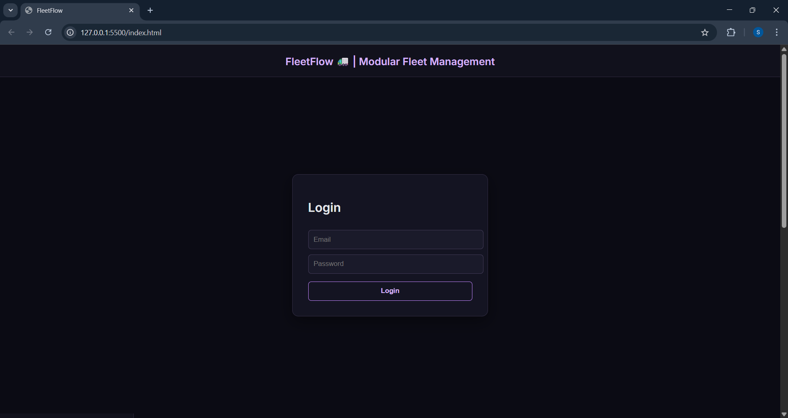
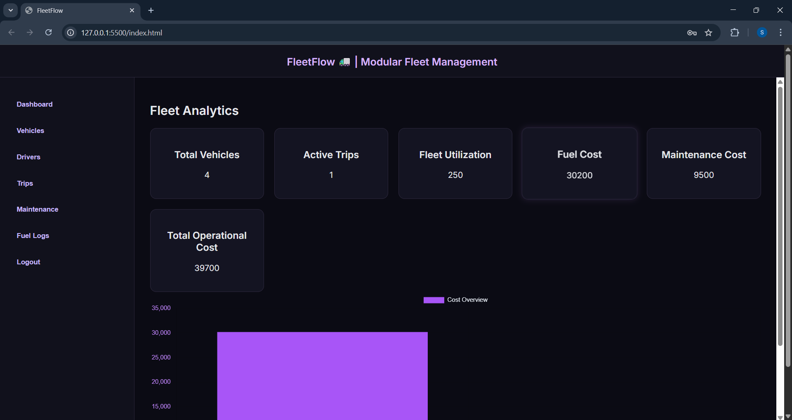

# 🚛 FleetFlow — Modular Fleet Management System

FleetFlow is a modern fleet operations dashboard designed to manage vehicles, drivers, trips, maintenance, and fuel logs with real-time analytics and performance insights.

Built for hackathon demonstration and scalable for real-world logistics operations.

---

## ✨ Features

- 🔐 Secure Login Authentication (Firebase Auth)
- 🚗 Vehicle Lifecycle Management
- 👨‍✈️ Driver Status & Compliance Tracking
- 📦 Smart Trip Dispatch System
- 🛠 Maintenance Workflow & Auto Status Updates
- ⛽ Fuel Log & Cost Monitoring
- 📊 Real-Time Analytics Dashboard
- 📈 Operational Cost Visualization (Chart.js)

---

## 🧠 Smart Capabilities

- Automatic vehicle status transitions
- Fleet utilization calculation
- Aggregated maintenance & fuel cost tracking
- Interactive analytics dashboard
- Clean modular architecture

---

## 🏗 Tech Stack

**Frontend**
- HTML5
- CSS3 (Dark Lavender Theme)
- JavaScript (ES6)

**Backend**
- Firebase Authentication
- Firebase Firestore

**Data Visualization**
- Chart.js

---

## 📁 Project Structure
FleetFlow/
│
├── index.html
├── style.css
├── app.js
├── README.md

---

## 🚀 How to Run

1. Clone the repository
2. Open project folder in VS Code
3. Use Live Server extension
4. Configure Firebase credentials inside `app.js`
5. Start using FleetFlow

---

## 🔒 Security

- Firebase Authentication enabled
- Firestore access restricted to authenticated users
- No sensitive credentials stored server-side

---

## 🌍 Future Enhancements

- Role-based access control
- Predictive maintenance alerts
- GPS tracking integration
- Exportable reports (PDF/CSV)
- Multi-branch fleet monitoring

---

## 👨‍💻 Developed For

ODOO Hackathon Project — 2026  
Designed to demonstrate scalable fleet automation and operational intelligence.

---

## 📸 Screenshots

### 🔐 Login Page

### 📊 Dashboard

---

